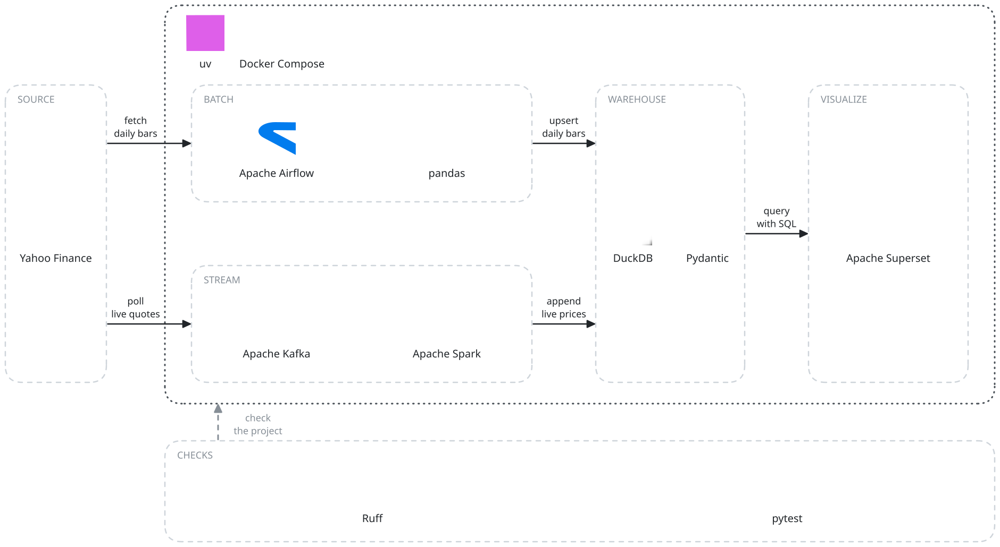

# open-data-stack

Batch and streaming pipelines that land Yahoo Finance stock prices in one DuckDB warehouse.

Status: building · portfolio project · 2026-10


## What it does

Collects daily bars and live quotes for five tickers (AAPL, GOOGL, MSFT, AMZN, META) into DuckDB.
SQL then answers daily open, close, high, low, volume and change, plus a log of live prices.

## How it works

1. **Source.** Yahoo Finance through yfinance, no API key. Daily bars come from each ticker's
   history, live quotes from its `fast_info`.
2. **Batch.** Airflow's daily DAG (06:00 UTC) extracts, validates, loads and reports the day's
   bars; a manual DAG backfills a period. The DAGs skip pandas: its moving averages run in the demo.
3. **Stream.** A producer publishes quotes to the Kafka topic `stock_prices` every 60 seconds; a
   consumer appends them to DuckDB in batches of 100. Spark's windowed stats print to the console.
4. **Warehouse.** One DuckDB file. `daily_aggregates` is upserted on symbol and date,
   `stock_prices` is appended, and `stocks` holds the seeded tickers.
5. **Visualize.** Superset runs in Docker Compose. `docker/superset/superset_init.py` prints its
   DuckDB connection, datasets and charts as JSON; `dashboards/` holds the dashboard layout.
6. **Checks.** Format, lint, types and tests run locally; the tests never touch the network.

## Tech stack



## Decisions

- **DuckDB over a warehouse server:** no server to run, and the whole warehouse is one portable
  file. Cost: one process writes the file at a time.
- **yfinance over a keyed market-data API:** no API key, so the stack runs with no sign-up.
  Cost: a failed quote is logged and skipped, not retried.
- **Upsert on symbol and date over append for daily bars:** a re-run or backfill replaces a day
  instead of duplicating it. Cost: one statement per row.

## Run it

Needs [uv](https://docs.astral.sh/uv/) and Docker.

```sh
uv sync
uv run python scripts/init_database.py   # create the tables, seed the five tickers
uv run python scripts/demo.py            # fetch a month, run the pandas metrics, load DuckDB
docker-compose up -d                     # Kafka, Spark, Airflow, Postgres, Superset
```

Airflow is on `localhost:8080`, Superset on `localhost:8088`, the Spark UI on `localhost:8081`;
sign-in settings are in `docker-compose.yml`. The producer, consumer and Spark job start from
Python: see [docs/reference.md](docs/reference.md).

## Checks

```sh
uv run ruff format .   # one code style
uv run ruff check .    # lint rules set in pyproject.toml
uv run mypy src/       # strict typing
uv run pytest          # yfinance and Kafka mocked, DuckDB in memory
```

No CI runs these; they run locally.

## Layout

```
src/open_data_stack/   ingestion, batch, streaming, processing (Spark), warehouse
dags/                  Airflow DAGs
docker/superset/       Superset config and the DuckDB connection definition
dashboards/            Superset dashboard definition
scripts/               database init and the demo run
docs/                  reference, diagrams
```

## Docs

- [docs/reference.md](docs/reference.md): services and ports, configuration, DAGs, warehouse
  tables, and Python usage for each part.
- [docs/diagrams/diagrams.py](docs/diagrams/diagrams.py): the scene script behind both diagrams.
